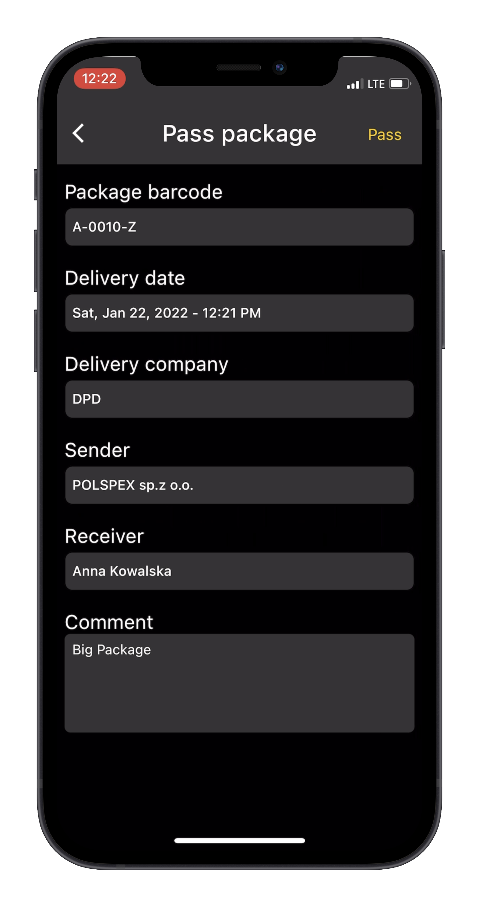

[![LinkedIn][linkedin-shield]][linkedin-url]

<!-- PROJECT LOGO -->
 

  <h3 align="center">Packup</h3>

  

    Mobile app for Android and iOS with web admin panel, for managing packages delivered to office.
  

<!-- ABOUT THE PROJECT -->
## About The Project

This project was created for a university course "Introduction to mobile applications" at Warsaw University of Technology.

Here's what I've learned:
* Since I have worked alone on this, I've realized that having a team is crucial, I've missed a designer, that's why it looks like crap :smile:, and testers, have had to ask my family to try it out
* You should plan a feature before developing/designin, have got left with some messy code and some broken SOLID rules
* Being fullstack is very fullfilling, I've experienced so much joy when my first requests from mobile app worked properly

### Built With

* [Flutter](https://flutter.dev/)
* [Django](https://www.djangoproject.com/)
* [Django REST framework](https://www.django-rest-framework.org/)
* [SQLite](https://www.sqlite.org/index.html)

### Screenshots

##### Main page

##### Barcode scanner

##### Add package

##### Pass package

##### Pass package result

##### History

##### Pick receiver

<!-- MARKDOWN LINKS & IMAGES -->
[linkedin-shield]: https://img.shields.io/badge/-LinkedIn-black.svg?style=for-the-badge&logo=linkedin&colorB=555
[linkedin-url]: https://linkedin.com/in/iasiu
[product-screenshot]: images/screenshot.png